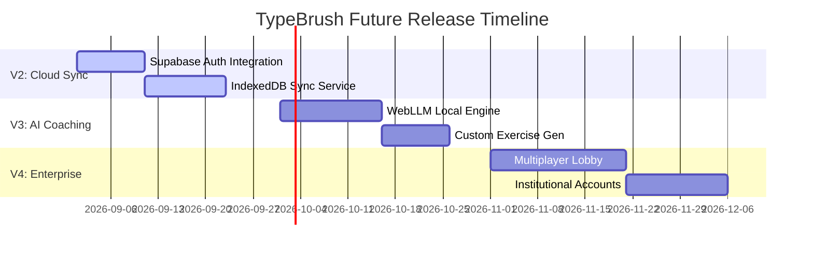

# TypeBrush — Product Implementation Roadmap

This document outlines the development status of key priorities, estimated complexities, risk assessments, and the recommended build order for upcoming features.

---

## 1. Roadmap Priorities Status

### Priority 1: Typing Gym Restructuring
- **Status**: **Completed (V1.5 Hardened)**
- **Work Done**: Created curriculum paths (guided training levels), integrated QWERTY keyboard animations, built custom landing states, and implemented personalized error recommendation blocks.

### Priority 2: Storage Layer Hardening
- **Status**: **Completed (V1.5 Hardened)**
- **Work Done**: Created a unified `storageService` proxy. All browser persistence logs migrate from LocalStorage to IndexedDB transactional object stores (`TypeBrushDB`) with atomic fallback routines for private browsing sessions.

### Priority 3: Gym Bug Fixes & Level Unlocks
- **Status**: **Completed (V1.5 Hardened)**
- **Work Done**: Converted progress getters/setters to run asynchronously. Fixed synchronous `setState` in effect loops. Resolved Emotion layout hydration mismatch errors on `GymWorkspace`, `InteractiveKeyboard`, `Footer`, and `page.js`.

### Priority 4: Enhanced Result Analytics
- **Status**: **Completed (V1.5 Hardened)**
- **Work Done**: Formulated Net vs Raw accuracy equations, tracked mistake character maps, displayed total key insertions, added print-ready PDF scorecards, and implemented native mobile sharing.

### Priority 5: SEO Pages & Content Expansion
- **Status**: **In Progress / Planned**
- **Goal**: Create highly optimized, indexable landing pages to target secondary typing keywords (e.g. coding tests, foreign layouts, competitive examinations).

---

## 2. Priority 5 (SEO Pages) Implementation Plan

### Targeted Routes & Content Clusters
1. **`/typing-test/coding`**:
   - Focus: Python, JavaScript, and HTML code fragments.
   - Purpose: Capture developer/student search volume for programming tests.
2. **`/typing-test/hindi`**:
   - Focus: Devnagari script typing support.
   - Purpose: Target Indian government examination candidates (SSC CHSL, SSC CGL).
3. **`/typing-practice/keyboard-drills`**:
   - Focus: Home-row, top-row, and bottom-row specific practice drills.
   - Purpose: Target beginner-level typing practice keywords.

### SEO Deliverables
- **Schema Markup**: Deploy `WebPage` and `SoftwareApplication` JSON-LD structures.
- **Internal Linking**: Update homepage and footer links to establish indexable URL paths.

---

## 3. Recommended Build Order (V2 to V4)

### Future Phases Description
- **V2: Cloud Sync & Accounts**:
  - Implement Supabase Auth.
  - Sync local IndexedDB records to PostgreSQL tables on login.
- **V3: AI Typing Coach**:
  - Load WebLLM (e.g. Llama-3-8B client-side) to diagnose weak-key habits.
  - Automatically compose target drills for the gym based on LLM outputs.
- **V4: Multiplayer & Teams**:
  - Implement WebSockets for real-time race lobbies.
  - Launch school/classroom progress tracking portals.

---

## 4. Complexity, Dependency & Risk Matrix

| Priority / Feature | Est. Complexity | Key Dependencies | Primary Risks | Mitigation Strategy |
| :--- | :--- | :--- | :--- | :--- |
| **SEO Pages & Hindi Typing** | Medium | Font configurations, Hindi Unicode maps | Layout breaks due to character rendering | Use standard Google Fonts; fallback to system fonts. |
| **V2: Cloud Sync** | High | PostgreSQL tables, Auth boundaries | Data loss during initial sync conflict | Implement "Local Wins" merge logic during first login. |
| **V3: AI Coach** | High | WebLLM browser compatibility | Memory leaks, slow load speeds | Lazy-load model scripts; request user permission before boot. |
| **V4: Multiplayer Lobbies** | Very High | WebSocket servers, state sync | High concurrent server hosting cost | Use peer-to-peer or serverless lobby coordinators where possible. |
